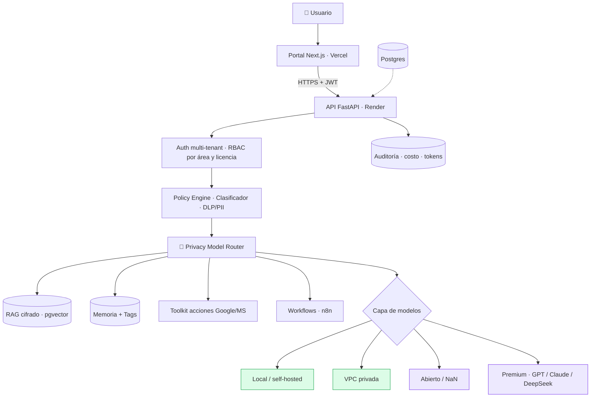
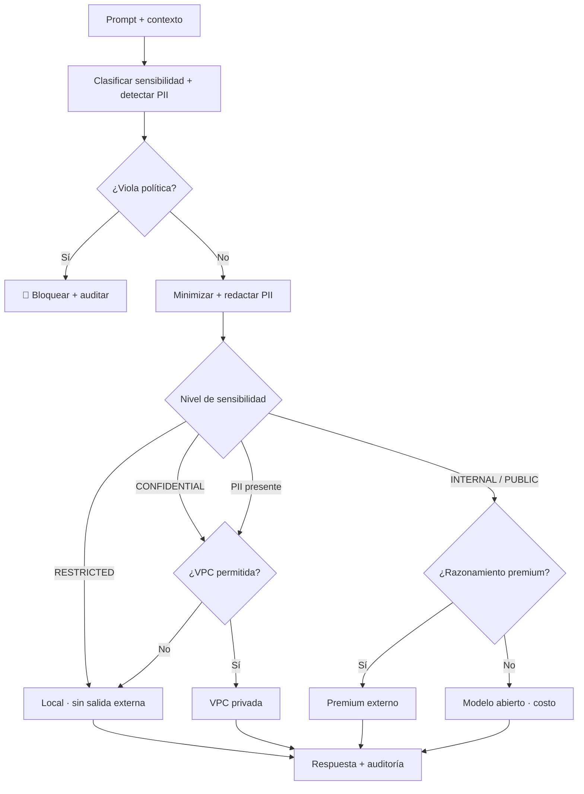
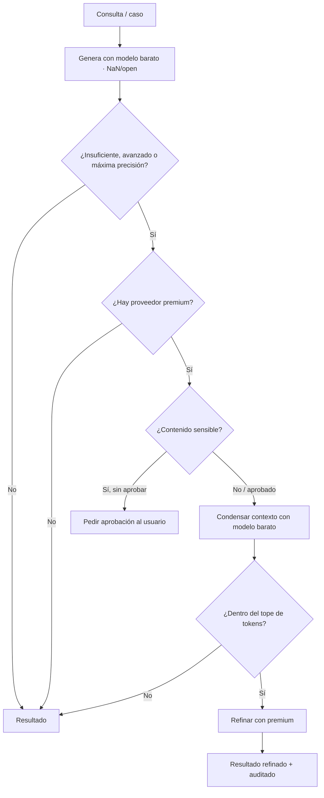
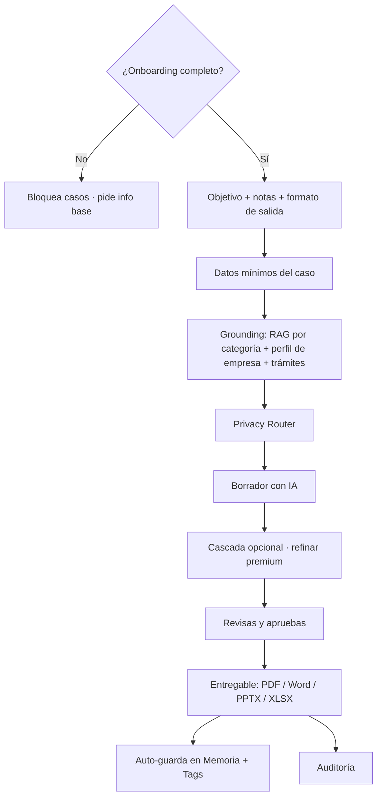
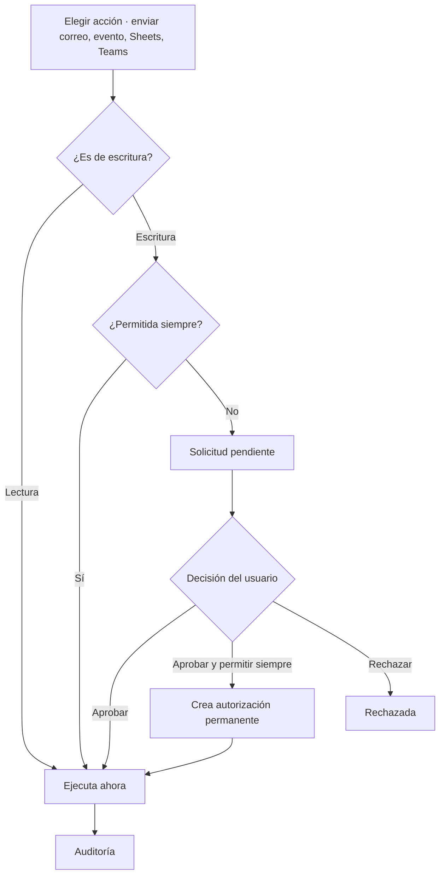
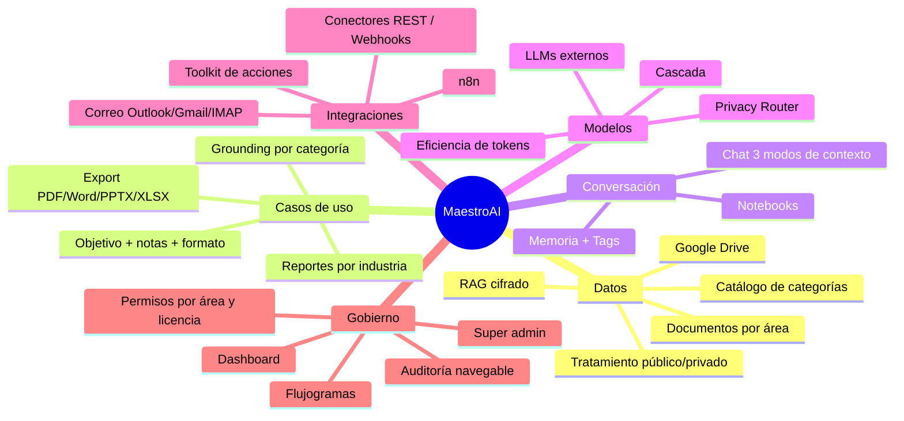
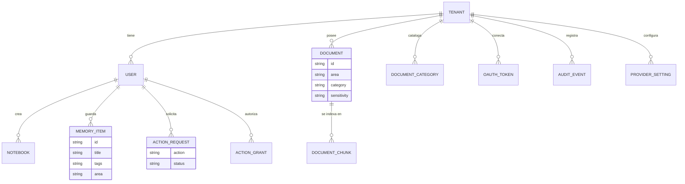
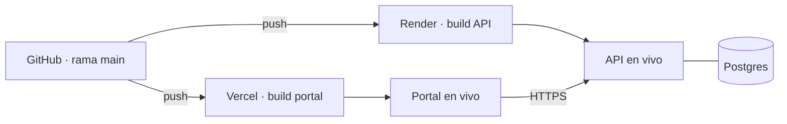

# Arquitectura y funcionalidades — MaestroAI

> Diagramas (Mermaid) de la plataforma. Se renderizan automáticamente en GitHub.
> Reflejan el código real. Última actualización: 2026-06-25.

---

## 1. Arquitectura por capas

🟩 verde = privado (no sale de tu infraestructura) · 🟪 morado = externo (con PII redactada).

---

## 2. Privacy Model Router (decisión de ruta)

Regla de oro: *si no es indispensable enviar el dato, no se envía.*

---

## 3. Cascada de modelos + eficiencia de tokens

Idea: el PDF grande lo digiere el modelo barato; el premium solo ve el extracto chico → más barato y privado.

---

## 4. Caso de uso (receta) de punta a punta

---

## 5. Toolkit de acciones (Google / Microsoft)

---

## 6. Mapa de funcionalidades

---

## 7. Modelo de datos (principal)

---

## 8. Despliegue

_MaestroAI · Arquitectura y funcionalidades._
