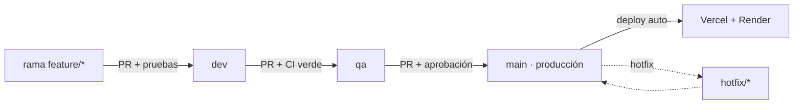

# Entornos y promoción — Dev → QA → Prod

> Modelo de trabajo para no romper producción: todo cambio pasa por **desarrollo**
> y **QA** (con pruebas) antes de llegar a **producción**. Cada promoción queda
> registrada en el [CHANGELOG](../CHANGELOG.md).

## Ramas y entornos

| Rama | Entorno | Despliegue | Para qué |
|------|---------|------------|----------|
| `dev` | Desarrollo | Preview (Vercel/Render) | Trabajo en curso, integración temprana |
| `qa` | QA / staging | Preview/staging | Validación funcional + pruebas automáticas |
| `main` | Producción | Vercel + Render (prod) | Estable, lo que usan los clientes |

## Flujo de promoción

## Reglas

1. **Nada va directo a `main`.** Se promueve por PR desde `qa`.
2. **CI obligatorio:** las pruebas de API (`pytest`) y el build del portal
   (`next build`) deben pasar antes de fusionar a `qa` y a `main`
   (ver `.github/workflows/ci.yml`).
3. **Bitácora:** cada PR agrega su entrada al `CHANGELOG.md` bajo *[No liberado]*;
   al promover a `main` se fecha.
4. **Hotfix:** si producción tiene un bug crítico, rama `hotfix/*` → `main`, y
   luego se retro-mergea a `qa` y `dev`.

## Configuración de despliegue recomendada

- **Vercel:** Production Branch = `main`. Las ramas `dev`/`qa` y los PRs generan
  *Preview Deployments* automáticos (URL por rama) → ahí se prueba sin tocar prod.
- **Render:** servicio de **producción** con Branch = `main` (auto-deploy). Opcional:
  un segundo servicio apuntando a `qa` como **staging** para validar la API.
- **Base de datos:** usar una BD distinta para QA/staging y otra para prod (no
  compartir datos). Las migraciones son aditivas e idempotentes.

## Variables por entorno

Cada entorno define sus propias variables (claves de OAuth, modelos externos,
`APP_PUBLIC_URL`, `DATABASE_URL`). Las llaves de prod **no** se reutilizan en QA.

_MaestroAI · Entornos y promoción._
